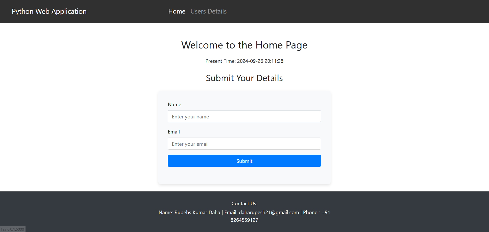
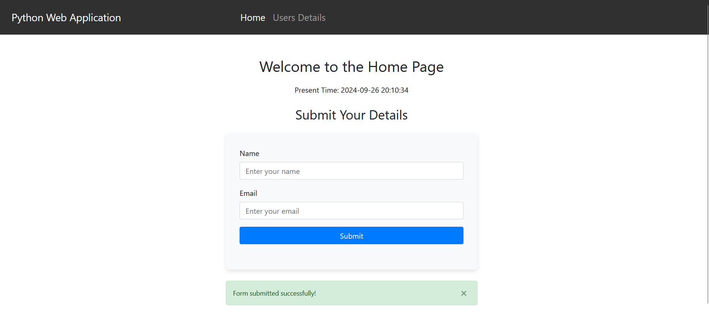
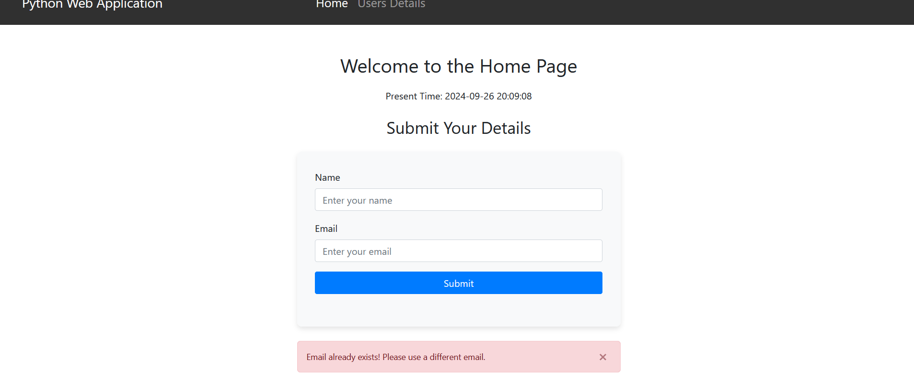
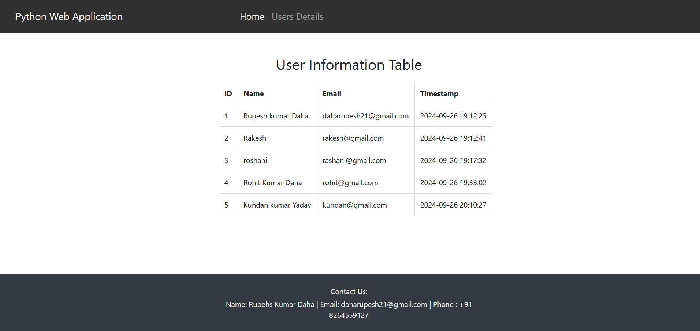

# Flask User Service Application

This is a simple Flask web application that allows users to register with their names and emails. The application validates input, prevents duplicate emails, and stores the user data in a MySQL database. The app also displays a list of all registered users.

## Features

- User registration with name and email.
- Server-side validation for name and email formats.
- Prevents duplicate email registrations.
- Stores user data in a MySQL database.
- Displays a list of all users in a table format.
  
## Screenshots

### Home Page





### Users Table Page




## Installation and Setup

### Prerequisites

- Python 3.x
- MySQL Server

### Step 1: Clone the Repository

```bash
git clone https://github.com/daharupesh/Flask-User-Service-Application.git

```

### Step 2: Install Dependencies

Make sure you have `pip` installed and then install the required packages.

```bash
pip install -r requirements.txt
```

Your `requirements.txt` file should include:

```txt
Flask
mysql-connector-python
```

### Step 3: Set up MySQL Database

1. Log in to MySQL and create a new database:

```sql
CREATE DATABASE user_service;
USE user_service;
```

2. Create the `users` table:

```sql
CREATE TABLE users (
    id INT AUTO_INCREMENT PRIMARY KEY,
    name VARCHAR(100),
    email VARCHAR(100) UNIQUE,
    timestamp TIMESTAMP
);
```

### Step 4: Configure Database Credentials

Ensure that the `db` variable in `app.py` contains the correct MySQL credentials for your setup:

```python
db = {
    'host': 'localhost',
    'user': 'root',  
    'password': '',  
    'database': 'user_service'
}
```

### Step 5: Run the Application

Start the Flask development server.

```bash
python app.py
```

The app will be running at `http://127.0.0.1:5000/`.

## Usage

- Open the homepage (`/`) to submit user registration details.
- The form will validate the name and email, and prevent duplicate email submissions.
- After submitting, you will be redirected to the `/users` page, which displays the list of registered users.
